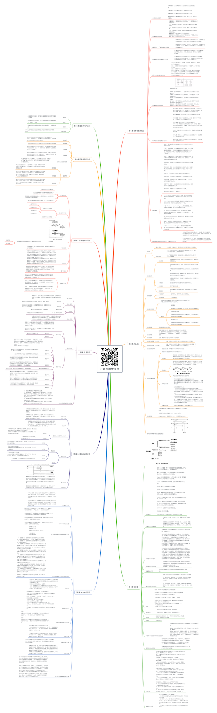

# 计算机组成原理

关注下方微信公众号，回复【思维导图】即可获得高清原图：

## 第1章 计算机系统概论

### 1.计算机系统简介

- 计算机系统：由计算机硬件系统和软件系统组成的综合体。

计算机硬件：指计算机中的电子线路和物理装置。

计算机软件：计算机运行所需的程序及相关资料。

硬件和软件在计算机系统中相互依存，缺一不可，因此同样重要。

### 2.计算机的层次结构

- 计算机硬件、系统软件和应用软件构成了计算机系统的三个层次结构。
（1）硬件系统是最内层的，它是整个计算机系统的基础和核心。
（2）系统软件在硬件之外，为用户提供一个基本操作界面。
（3）应用软件在最外层，为用户提供解决具体问题的应用系统界面。
通常将硬件系统之外的其余层称为虚拟机。
各层次之间关系密切，上层是下层的扩展，下层是上层的基础，各层次的划分不是绝对的。

### 3.高级语言、汇编语言和机器语言

- 机器语言是计算机硬件能够直接识别的语言，汇编语言是机器语言的符号表示，高级语言是面向算法的语言。

高级语言编写的程序（源程序）处于最高层，必须翻译成汇编语言，再由汇编程序汇编成机器语言（目标程序）之后才能被执行。

### 4.计算机组成和计算机体系结构

- 计算机体系结构是指那些能够被程序员所见到的计算机系统的属性，如指令系统、数据类型、寻址技术组成及I/O机理等。

计算机组成是指如何实现计算机体系结构所体现的属性，包含对程序员透明的硬件细节，如组成计算机系统的各个功能部件的结构和功能，及相互连接方法等。

### 5.冯•诺依曼计算机的特点

- 1.计算机由运算器、控制器、存储器、输入设备、输出设备五大部件组成；
2.指令和数据以同同等地位存放于存储器内，并可以按地址访问；
3.指令和数据均用二进制表示；
4.指令由操作码、地址码两大部分组成，操作码用来表示操作的性质，地址码用来表示操作数在存储器中的位置；
5.指令在存储器中顺序存放，通常自动顺序取出执行；
6.机器以运算器为中心。

### 6.计算机硬件组成框图

- 各部件的作用：

控制器：整机的指挥中心，它使计算机的各个部件自动协调工作。
运算器：对数据信息进行处理的部件，用来进行算术运算和逻辑运算。
存储器：存放程序和数据，是计算机实现“存储程序控制”的基础。
输入设备：将人们熟悉的信息形式转换成计算机可以接受并识别的信息形式的设备。
输出设备：将计算机处理的结果（二进制信息）转换成人类或其它设备可以接收和识别的信息形式的设备。

### 7.计算机系统的主要技术指标

- 机器字长：指CPU一次能处理的数据的位数。通常与CPU的寄存器的位数有关，字长越长，数的表示范围越大，精度也越高。机器字长也会影响计算机的运算速度。

数据通路宽度：数据总线一次能并行传送的数据位数。

存储容量：指能存储信息的最大容量，通常以字节来衡量。一般包含主存容量和辅存容量。

运算速度：通常用MIPS（每秒百万条指令）、MFLOPS（每秒百万次浮点运算）或CPI（执行一条指令所需的时钟周期数）来衡量。CPU执行时间是指CPU对特定程序的执行时间。

主频：机器内部主时钟的运行频率，是衡量机器速度的重要参数。

吞吐量：指流入、处理和流出系统的信息速率。它主要取决于主存的存取周期。

响应时间：计算机系统对特定事件的响应时间，如实时响应外部中断的时间等。

### 8.名词解释

- 主机：是计算机硬件的主体部分，由CPU和主存储器MM合成为主机。

CPU：中央处理器，是计算机硬件的核心部件，由运算器和控制器组成。（早期的运算器和控制器不在同一芯片上，现在的CPU内除含有运算器和控制器外还集成了CACHE）。

主存：计算机中存放正在运行的程序和数据的存储器，为计算机的主要工作存储器，可随机存取；由存储体、各种逻辑部件及控制电路组成。

存储单元：可存放一个机器字并具有特定存储地址的存储单位。

存储元件：存储一位二进制信息的物理元件，是存储器中最小的存储单位，又叫存储基元或存储元，不能单独存取。

存储字：一个存储单元所存二进制代码的逻辑单位。

存储字长：一个存储单元所存储的二进制代码的总位数。

存储容量：存储器中可存二进制代码的总量；（通常主、辅存容量分开描述）。

机器字长：指CPU一次能处理的二进制数据的位数，通常与CPU的寄存器位数有关。

指令字长：机器指令中二进制代码的总位数。

指令字长 = 存储字长 = 机器字长
- PC：Program Counter，程序计数器，其功能是存放当前欲执行指令的地址，并可自动计数形成下一条指令地址。

ACC：Accumulator，累加器，是运算器中既能存放运算前的操作数，又能存放运算结果的寄存器。

MQ：Multiplier-Quotient Register，乘商寄存器，乘法运算时存放乘数、除法时存放商的寄存器。

X：此字母没有专指的缩写含义，可以用作任一部件名，在此表示操作数寄存器，即运算器中工作寄存器之一，用来存放操作数。

IR：Instruction Register，指令寄存器，其功能是存放当前正在执行的指令。

MAR：Memory Address Register，存储器地址寄存器，在主存中用来存放欲访问的存储单元的地址。

MDR：Memory Data Register，存储器数据缓冲寄存器，在主存中用来存放从某单元读出、或要写入某存储单元的数据。

### 9.指令和数据都存于存储器中，计算机如何区分

- 1.通过不同的时间段来区分指令和数据，即在取指令阶段（或取指微程序）取出的为指令，在执行指令阶段（或相应微程序）取出的即为数据。

2.通过地址来源区分，由PC提供存储单元地址的取出的是指令，由指令地址码部分提供存储单元地址的取出的是操作数。

## 第3章 系统总线

### 总线

- 基本概念

	- 总线是一种能由多个部件分时共享的公共信息传送线路。

- 总线特点

	- 某一时刻只允许有一个部件向总线发送信息，但多个部件可以同时从总线上接收相同的信息。

为了减轻总线负载，总线上的部件应通过三态驱动缓冲电路与总线连通。

### 总线分类

- 划分依据

	- 按照连接部件的不同，总线可以分为片内总线、系统总线和通信总线。

- 系统总线

	- 系统总线是连接CPU、主存、I/O各部件之间的信息传输线。

系统总线按照传输信息不同又分为地址线、数据线和控制线。

地址总线是单向的，其根数越多，寻址空间越大，即CPU能访问的存储单元的个数越多。

数据总线是双向的，其根数与存储字长相同，是机器字长的整数倍。

控制总线是用来发出各种控制信号的传输线。

- 片内总线

	- 芯片内部的总线。

- 通信总线

	- 用于计算机系统之间或计算机系统与其他系统之间的通信。

### 总线结构

- 单总线结构

	- 结构简单，便于扩充，工作效率低。

- 多总线结构

	- 工作效率高

### 总线判优控制

- 总线判优控制解决多个部件同时申请总线时的使用权分配问题。分为集中式和分布式两种。
- 集中式

	- 链式查询

链式查询方式连线简单，易于扩充，对电路故障最敏感
	- 计数器定时查询

计数器定时查询方式优先级设置较灵活，对故障不敏感，连线及控制过程较复杂
	- 独立请求方式

计数器定时查询方式优先级设置较灵活，对故障不敏感，连线及控制过程较复杂

### 总线宽度

- 通常指数据总线的根数

### 总线带宽

- 总线的数据传输率，指单位时间内总线上传输数据的位数。通常用每秒传输信息的字节数来衡量。它与总线宽度和总线频率有关，总线宽度越宽，频率越快，数据传输率越高。

### 总线复用

- 指同一条信号线可以分时传输不同的信号

### 总线的主设备（主模块）

- 指一次总线传输期间，拥有总线控制权的设备（模块）

### 总线的从设备（从模块）

- 指一次总线传输期间，配合主设备完成数据传输的设备（模块），它只能被动接受主设备发来的命令

### 总线的传输周期

- 指总线完成一次完整而可靠的传输所需时间

### 总线的通信控制

- 指总线传送过程中双方的时间配合方式
- 同步通信

	- 指由统一时钟控制的通信，控制方式简单，灵活性差，当系统中各部件工作速度差异较大时，总线工作效率明显下降。适合于速度差别不大的场合。

- 异步通信

	- 指没有统一时钟控制的通信，部件间采用应答方式进行联系，控制方式较同步复杂，灵活性高，当系统中各部件工作速度差异较大时，有利于提高总线工作效率。
	- 异步通信中请求与回答互锁关系

- 半同步通信

	- 同时保留了同步通信和异步通信的特点：
半同步通信既能像同步通信那样由统一时钟控制，又能像异步通信那样允许传输时间不一致，因此工作效率介于两者之间。

- 分离式通信

	- 分离式通信的特点是：
（1）各模块欲占用总线使用权都必须提出申请；
（2）在得到总线使用权后，主模块在先定的时间内向对方传送信息，采用同步方式传送，不再等待对方的回答信号；
（3）各模块在准备数据的过程中都不占用总线，使总线可接受其它模块的请求；
（4）总线被占用时都在做有效工作，或者通过它发送命令，或者通过它传送数据，不存在空闲等待时间，充分利用了总线的占用，从而实现了总线在多个主、从模块间进行信息交叉重叠并行传送。

分离式通信主要用于大型计算机系统。

### 总线标准

- 总线标准的设置主要解决不同厂家各类模块化产品的兼容问题。

目前流行的总线标准有：ISA、EISA、PCI等。

plug and play：即插即用，EISA、PCI等具有此功能。

### 具有双向传输功能的总线逻辑图

## 第4章 存储器

### 名词解释

- 主存：主存储器，用于存放正在执行的程序和数据。CPU可以直接进行随机读写，访问速度较高。

辅存：辅助存储器，用于存放当前暂不执行的程序和数据，以及一些需要永久保存的信息。

Cache：高速缓冲存储器，介于CPU和主存之间，用于解决CPU和主存之间速度不匹配问题。

RAM：半导体随机存取存储器，主要用作计算机中的主存。

SRAM：静态半导体随机存取存储器。

DRAM：动态半导体随机存取存储器。

ROM：掩膜式半导体只读存储器。由芯片制造商在制造时写入内容，以后只能读出而不能写入。

PROM：可编程只读存储器，由用户根据需要确定写入内容，只能写入一次。

EPROM：紫外线擦写可编程只读存储器。需要修改内容时，现将其全部内容擦除，然后再编程。擦除依靠紫外线使浮动栅极上的电荷泄露而实现。

EEPROM：电擦写可编程只读存储器。

CDROM：只读型光盘。

Flash Memory：闪速存储器。或称快擦型存储器。

### 计算机可以存储信息

- 计算机中寄存器、Cache、主存、硬盘可以用于存储信息。

按速度由高至低排序为：寄存器、Cache、主存、硬盘；
按容量由小至大排序为：寄存器、Cache、主存、硬盘；
按价格/位由高至低排序为：寄存器、Cache、主存、硬盘。

### 存储器的层次结构

- 存储器的层次结构主要体现在Cache-主存和主存-辅存这两个存储层次上。

Cache-主存层次在存储系统中主要对CPU访存起加速作用，即从整体运行的效果分析，CPU访存速度加快，接近于Cache的速度，而寻址空间和位价却接近于主存。
主存-辅存层次在存储系统中主要起扩容作用，即从程序员的角度看，他所使用的存储器其容量和位价接近于辅存，而速度接近于主存。
综合上述两个存储层次的作用，从整个存储系统来看，就达到了速度快、容量大、位价低的优化效果。

主存与CACHE之间的信息调度功能全部由硬件自动完成。而主存与辅存层次的调度目前广泛采用虚拟存储技术实现，即将主存与辅存的一部分通过软硬结合的技术组成虚拟存储器，程序员可使用这个比主存实际空间（物理地址空间）大得多的虚拟地址空间（逻辑地址空间）编程，当程序运行时，再由软、硬件自动配合完成虚拟地址空间与主存实际物理空间的转换。因此，这两个层次上的调度或转换操作对于程序员来说都是透明的。

### 存取周期和存取时间

- 存取周期和存取时间的主要区别是：存取时间仅为完成一次操作的时间，而存取周期不仅包含操作时间，还包含操作后线路的恢复时间。即：
存取周期 = 存取时间 + 恢复时间

### 存储器的带宽

- 存储器的带宽指单位时间内从存储器进出信息的最大数量。

### 静态RAM和动态RAM

- 区别：动态RAM会周期性的刷新，静态RAM不进行刷新

1、静态RAM，指SRAM：只要有供电，它保存的数据就不会丢失，且为高速存储器，如CPU中的高速缓存（cache）

2、动态RAM，指DRAM：有供电，还要根据它要求的刷新时间参数，才能保持存储的数据不丢失，如电脑中的内存条

### 刷新

- 刷新：对DRAM定期进行的全部重写过程；

刷新原因：因电容泄漏而引起的DRAM所存信息的衰减需要及时补充，因此安排了定期刷新操作；

常用的刷新方法有三种：集中式、分散式、异步式。

集中式：在最大刷新间隔时间内，集中安排一段时间进行刷新，存在CPU访存死时间。
分散式：在每个读/写周期之后插入一个刷新周期，无CPU访存死时间。
异步式：是集中式和分散式的折衷。

### 寻址范围

- 按字节编址的寻址范围就是：存储容量

如按字编址，其寻址范围为：存储容量÷字长

### 地址线

- 地址线的数量n满足：2^n>=存储容量的比特数，解出最小的n，即是地址线的数量。

### 数据线

- 与字长相等

### 半导体存储器芯片的译码驱动方式

- 半导体存储器芯片的译码驱动方式有两种：线选法和重合法。

线选法：地址译码信号只选中同一个字的所有位，结构简单，费器材；
重合法：地址分行、列两部分译码，行、列译码线的交叉点即为所选单元。这种方法通过行、列译码信号的重合来选址，也称矩阵译码。可大大节省器材用量，是最常用的译码驱动方式。

### 程序访问的局部性

- 程序运行的局部性原理指：在一小段时间内，最近被访问过的程序和数据很可能再次被访问；在空间上，这些被访问的程序和数据往往集中在一小片存储区；在访问顺序上，指令顺序执行比转移执行的可能性大 (大约 5:1 )。

存储系统中Cache-主存层次和主存-辅存层次均采用了程序访问的局部性原理。

### Chache

- 计算机中设置Cache的作用是什么？能否将Cache的容量扩大，最后取代主存，为什么？
答：计算机中设置Cache的作用是解决CPU和主存速度不匹配问题。
不能将Cache的容量扩大取代主存，原因是:
（1）Cache容量越大成本越高，难以满足人们追求低价格的要求；
（2）如果取消主存，当CPU访问Cache失败时，需要将辅存的内容调入Cache再由CPU访问，造成CPU等待时间太长，损失更大。

Cache做在CPU芯片内主要有下面几个好处：
（1）可提高外部总线的利用率。因为Cache在CPU芯片内，CPU访问Cache时不必占用外部总线。
（2）Cache不占用外部总线就意味着外部总线可更多地支持I/O设备与主存的信息传输，增强了系统的整体效率。
（3）可提高存取速度。因为Cache与CPU之间的数据通路大大缩短,故存取速度得以提高。

将指令Cache和数据Cache分开有如下好处：
1）可支持超前控制和流水线控制，有利于这类控制方式下指令预取操作的完成。
2）指令Cache可用ROM实现，以提高指令存取的可靠性。
3）数据Cache对不同数据类型的支持更为灵活，既可支持整数（例32位），也可支持浮点数据（如64位）。

### 提高访存速度

- 提高访存速度可采取三种措施：
（1）采用高速器件。即采用存储周期短的芯片，可提高访存速度。
（2）采用Cache。CPU最近要使用的信息先调入Cache，而Cache的速度比主存快得多，这样CPU每次只需从Cache中读写信息，从而缩短访存时间，提高访存速度。
（3）调整主存结构。如采用单体多字或采用多体结构存储器。

## 第5章 输入输出系统

### I/O编址方式

- I/O与内存统一编址方式 的I/O地址采用与主存单元地址完全一样的格式，I/O设备和主存占用同一个地址空间，CPU可像访问主存一样访问I/O设备，不需要安排专门的I/O指令。

 I/O独立编址方式 时机器为I/O设备专门安排一套完全不同于主存地址格式的地址编码，此时I/O地址与主存地址是两个独立的空间，CPU需要通过专门的I/O指令来访问I/O地址空间。

### CPU与I/O传递信息

- CPU与I/O之间传递信息常采用三种联络方式：直接控制（立即响应）、 同步、异步。 适用场合分别为：

直接控制适用于结构极简单、速度极慢的I/O设备，CPU直接控制外设处于某种状态而无须联络信号。

同步方式采用统一的时标进行联络，适用于CPU与I/O速度差不大，近距离传送的场合。

异步方式采用应答机制进行联络，适用于CPU与I/O速度差较大、远距离传送的场合。

### I/O 设备与主机信息传送的控制方式

- 程序查询方式
程序中断方式
直接存储器存取方式（DMA）

I/O通道方式
I/O处理机方式

### 比较程序查询、程序中断和DMA

- （1）程序查询、程序中断方式的数据传送主要依赖软件，DMA主要依赖硬件。 （注意：这里指主要的趋势）
（2）程序查询、程序中断传送数据的基本单位为字或字节，DMA为数据块。
（3）程序查询方式传送时，CPU与I/O设备串行工作；程序中断方式时，CPU与I/O设备并行工作，现行程序与I/O传送串行进行；DMA方式时，CPU与I/O设备并行工作，现行程序与I/O传送并行进行。
（4）程序查询方式时，CPU主动查询I/O设备状态；程序中断及DMA方式时，CPU被动接受I/O中断请求或DMA请求。
（5）程序中断方式由于软件额外开销时间比较大，因此传输速度最慢；程序查询方式软件额外开销时间基本没有，因此传输速度比中断快；DMA方式基本由硬件实现传送，因此速度最快；
注意：程序中断方式虽然CPU运行效率比程序查询高，但传输速度却比程序查询慢。
（6）程序查询接口硬件结构最简单，因此最经济；程序中断接口硬件结构稍微复杂一些，因此较经济；DMA控制器硬件结构最复杂，因此成本最高；
（7）程序中断方式适用于中、低速设备的I/O交换；程序查询方式适用于中、低速实时处理过程；DMA方式适用于高速设备的I/O交换；

程序查询、程序中断为I/O与CPU之间交换，DMA为I/O与主存间交换。

### I/O接口

- I/O接口一般指CPU和I/O设备间的连接部件，而端口是指I/O接口内CPU能够访问的寄存器，端口加上相应的控制逻辑即构成I/O接口。
I/O接口分类方法很多，主要有：
（1）按数据传送方式分有并行接口和串行接口两种；
（2）按数据传送的控制方式分有程序控制接口、程序中断接口、DMA接口三种。

### 程序查询接口

- 程序查询接口工作过程如下（以输入为例）：
1）CPU发I/O地址设备开始工作；地址总线接口设备选择器译码选中发SEL信号；
2）CPU发启动命令 DBR开命令接收门；  D置0，B置1  接口向设备发启动命令；
3）CPU等待，输入设备读出数据；
4）外设工作完成，B置0，D置1；
5）准备就绪信号接口完成信号控制总线 CPU；
6）输入：CPU通过输入指令（IN）将DBR中的数据取走。
若为输出，除数据传送方向相反以外，其他操作与输入类似。

### 中断向量地址和入口地址

- 区别：
向量地址是硬件电路（向量编码器）产生的中断源的内存地址编号，中断入口地址是中断服务程序首址。

联系：
中断向量地址可理解为中断服务程序入口地址指示器（入口地址的地址），通过它访存可获得中断服务程序入口地址。 

### 中断请求

- I/O设备向CPU提出中断请求的条件是：
I/O接口中的设备工作完成状态为1（D=1），中断屏蔽码为0 （MASK=0），且CPU查询中断时，中断请求触发器状态为1（INTR=1）。

CPU响应I/O中断请求的条件和时间是：当中断允许状态为1（EINT=1），且至少有一个中断请求被查到，则在一条指令执行完时，响应中断。

### 中断允许触发器

- 中断允许触发器是CPU中断系统中的一个部件，他起着开关中断的作用（即中断总开关，则中断屏蔽触发器可视为中断的分开关）。

### 多重中断

- 多重中断是指：当CPU执行某个中断服务程序的过程中，发生了更高级、更紧迫的事件，CPU暂停现行中断服务程序的执行，转去处理该事件的中断，处理完返回现行中断服务程序继续执行的过程。
实现多重中断的必要条件是：在现行中断服务期间，中断允许触发器为1，即开中断。

### CPU对DMA请求和中断请求

- CPU对DMA请求和中断请求的响应时间不一样，因为两种方式的交换速度相差很大，因此CPU必须以更短的时间间隔查询并响应DMA请求。响应中断请求是在每条指令执行周期结束的时刻，而响应DMA请求是在存取周期结束的时刻。

中断方式是程序切换，而程序又是由指令组成，所以必须在一条指令执行完毕才能响应中断请求，而且CPU只有在每条指令执行周期结束的时刻才发出查询信号，以获取中断请求信号，若此时条件满足，便能响应中断请求。
DMA请求是由DMA接口根据设备的工作状态向CPU申请占用总线，此时只要总线未被CPU占用，即可立即响应DMA请求；若总线正被CPU占用，则必须等待该存取周期结束时，CPU才交出总线的使用权。

## 第6章 计算机的运算方法

### 无符号数
有符号数

- 计算机里的数是用二进制表示的，最左边的这一位一般用来表示这个数是正数还是负数，这样的话这个数就是有符号整数。

如果最左边这一位不用来表示正负，而是和后面的连在一起表示整数，那么就不能区分这个数是正还是负，就只能是正数，这就是无符号整数。

### 机器零

- 机器零指机器数所表示的零的形式，它与真值零的区别是：机器零在数轴上表示为“0”点及其附近的一段区域，即在计算机中小到机器数的精度达不到的数均视为“机器零”，而真零对应数轴上的一点（0点）。

### 数的定点表示与浮点表示

- 定点数

	- 小数点固定在某一位置的数为定点数，固定的小数点位置决定了固定位数的整数部分和小数部分。
比如 99.00 或者 00.99 可以用于表达具有四位精度小数点后有两位的货币值。

- 浮点数

	- 小数点的位置可以浮动的数。
比如 1.23*10^2

### 有符号数

- 机器数

	- 原码

		- 就是符号位加上真值的绝对值， 即用第一位表示符号， 其余位表示值。

	- 反码

		- 正数的反码是其本身；
负数的反码是在其原码的基础上， 符号位不变，其余各个位取反。

	- 补码

		- 正数的补码就是其本身；
负数的补码是在其原码的基础上， 符号位不变， 其余各位取反， 最后+1。 (即在反码的基础上+1)

	- 移码

		- 不管正负数，只要将其补码的符号位取反即可。

- 真值

### 算术移位

- 算术移位是对带符号数进行的移位操作，其关键规则是移位时符号位保持不变，空出位的补入值与数的正负、移位方向、采用的码制等有关。补码或反码右移时具有符号延伸特性。左移时可能产生溢出错误，右移时可能丢失精度。

### 逻辑移位

- 逻辑移位是对逻辑数或无符号数进行的移位，其特点是不论左移还是右移，空出位均补0，移位时不考虑符号位。

## 第7章 指令系统

### 机器指令

- 机器指令：是CPU能直接识别并执行的指令，它的表现形式是二进制编码。机器指令通常由操作码和操作数两部分组成。 

### 指令格式

- 操作码

	- 操作码指明该指令完成的操作，如加法、减法、移位等。

- 地址码

	- 地址码用来指出该指令的源操作数的地址、结果的地址以及下一条指令的地址。

### 地址码

- 零地址指令

	- 零地址指令无地址码，只有操作码。

- 一、二、三、四地址指令

	- 根据地址码字段的数量进行划分

### 指令系统

- 计算机所能执行的全部指令的集合，它描述了计算机内全部的控制信息和“逻辑判断”能力。  指令系统是计算机硬件和软件的接口部分，是全部机器指令的集合。

### 寻址方式

	- 指确定本条指令的数据地址以及下一条将要执行的指令地址的方法，它与硬件结构紧密相关，而且直接影响指令格式和指令功能。

学习寻址方式，是为了找到指令中参与操作的数据，然后根据指令，得出结果。

- 指令寻址

	- 顺序寻址

		- 通过程序计数器PC加1

	- 跳跃寻址

- 数据寻址

		- 在指令字中必须设一字段来指明 哪一种寻址方式。指令的地址码字段通常都不代表操作数的真实地址，把它称为形式地址，记作A。操作数的真实地址称为有效地址，记作EA。
操作码+寻址特征+形式地址A

	- 立即寻址

		- 操作数本身设在指令字内，即形式地址不是操作数的地址，而是操作数本身。

	- 直接寻址

		- 指令字中的形式地址A就是操作数的真实地址EA

	- 隐含寻址

		- 指令字中不明显地给出操作数的地址，其操作数的地址隐含在操作码或某个寄存器中。

	- 间接寻址

		- 指令中的形式地址不直接指出操作数的地址，而是指出操作数有效地址所在的存储单元地址，也就是说，有效地址是由形式地址间接提供的，即为间接寻址。

	- 寄存器间接寻址方式

		- 在指令字中，地址码字段直接指出了寄存器的编号。

	- 基址寻址

		- 基址寻址需设有基址寄存器BR，其操作数的有效地址EA等于指令字中的形式地址A与基址寄存器中的内容（称为基地址）相加。

	- 变址寻址

		- 变址寻址需设有变址寄存器IX，其操作数的有效抵制EA等于指令字中的形式地址A与变址寄存器IX的内容相加。

	- 相对寻址

		- 相对寻址的有效地址是将程序计数器PC的内容（即当前指令的地址）与指令字中的形式地址A相加而成。

	- 堆栈地址

### 比较基址寻址和变址寻址

- 1）都可以有效的扩大指令寻址范围。
2）基址寻址时，基准地址由基址寄存器给出，地址的改变反映在位移量A的取值上，变址寻址时，基准地址由A给出，地址的改变反映在变址值的自动修改上，变址值由变址寄存器给出。
3）基址寄存器内容通常由系统程序设定，变址寄存器内容通常由用户设定。
4）基址寻址适用于程序的动态重定位，变址寻址适用于数组或字符串处理，适用场合不同。

## 第8章 CPU的结构和功能

### CPU的结构

- 1.用于存放指令的寄存器
- 能发出各种操作命令序列的控制部件CU
- 要完成算术运算和逻辑运算，必须有存放操作数的寄存器和实现逻辑运算的部件ALU
- 为了处理异常情况和特殊请求，还必须有中断系统

### CPU的寄存器

- 1.用户可见寄存器

	- 1.通用寄存器
	- 2.数据寄存器
	- 3.地址寄存器
	- 4.条件码寄存器

- 2.控制和状态寄存器

### 指令周期

- 指令周期是指取出并执行完一条指令所需的时间。

	- 取指周期
	- 执行周期

### 中断周期

- 在中断周期，CPU应完成保存断点、将中断向量送PC和关中断等工作。

### 并行性

- 所谓并行性包含同时性和并发性。同时性是指两个或两个以上的事件在同一时刻发生，并发性是指两个或多个事件在同一时间段发生。即在同一时刻或同一时间段内完成两个或两个以上性质相同或性质不同的功能，只要在时间上存在相互重叠，就存在并行性。
并行性又分为粗粒度并行和细粒度并行两类。粗粒度并行是指在多个处理机上分别运行多个进程，由多台处理机合作完成一个程序，一般用算法实现。细粒度并行是指在处理机的指令级和操作级的并行性。

### 指令流水

- 指令流水是指将一条指令的执行过程分为n个操作时间大致相等的阶段，每个阶段由一个独立的功能部件来完成，这样n个部件就可以同时执行n条指令的不同阶段，从而大大提高CPU的吞吐率。

### 中断触发器

- INTR——中断请求触发器，用来登记中断源发出的随机性中断请求信号，以便为CPU查询中断及中断排队判优线路提供稳定的中断请求信号。
- INTR——中断请求触发器，用来登记中断源发出的随机性中断请求信号，以便为CPU查询中断及中断排队判优线路提供稳定的中断请求信号。
- INT——中断标记触发器，控制器时序系统中周期状态分配电路的一部分，表示中断周期标记。当INT=1时，进入中断周期，执行中断隐指令的操作。

## 第9章 控制单元的功能

### 控制单元

- 控制单元的主要功能是发出各种不同的控制信号。
其输入受时钟信号、指令寄存器的操作码字段、标志和来自系统总线的控制信号的控制。

### 指令周期

- CPU每取出并执行一条指令所需的全部时间叫指令周期

### 机器周期

- 机器周期是在同步控制的机器中，执行指令周期中一步相对完整的操作（指令步）所需时间，通常安排机器周期长度等于主存周期

### 时钟周期

- 时钟周期是指计算机主时钟的周期时间，它是计算机运行时最基本的时序单位，对应完成一个微操作所需时间，通常时钟周期等于计算机主频的倒数。

### 影响机器速度的因素

- 机器的速度不仅与主频有关，还与数据通路结构、时序分配方案、ALU运算能力、指令功能强弱等多种因素有关，要看综合效果。

### 控制方式

- 同步控制

	- 同步控制是指任何一条指令或指令中任何一个微操作的执行都是事先确定的，并且都受同一基准时标的时序信号所控制的方式。

- 异步控制

	- 异步控制无基准时标信号，微操作的时序是由专门的应答线路控制，即控制单元发出执行某一微操作的控制信号后，等待执行部件完成了该操作后发回“回答”或“结束”信号，再开始新的微操作。

- 联合控制

	- 联合控制是同步控制和异步控制相结合的方式，即大多数操作（如CPU内部各操作）在同步时序信号的控制下进行，少数时间难以确定的微操作（如涉及I/O操作）采用异步控制。

## 第10章 控制单元的设计

### 微操作

- 在微程序控制器中，执行部件接受微指令后所进行的最基本的操作。

### 微指令

- 控制器存储的控制代码，分为操作控制部分和顺序控制部分，由微命令组成。

### 微程序

- 存储在控制存储器中的完成指令功能的程序，由微指令组成。

### 控制存储器

- CPU内用于存放实现指令系统全部指令的微程序的只读存储器。

*XMind: ZEN - Trial Version*